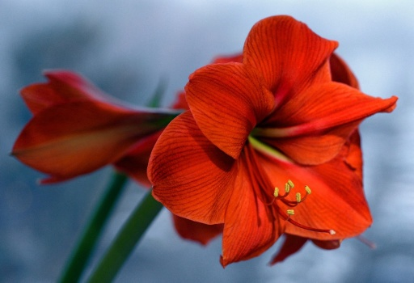
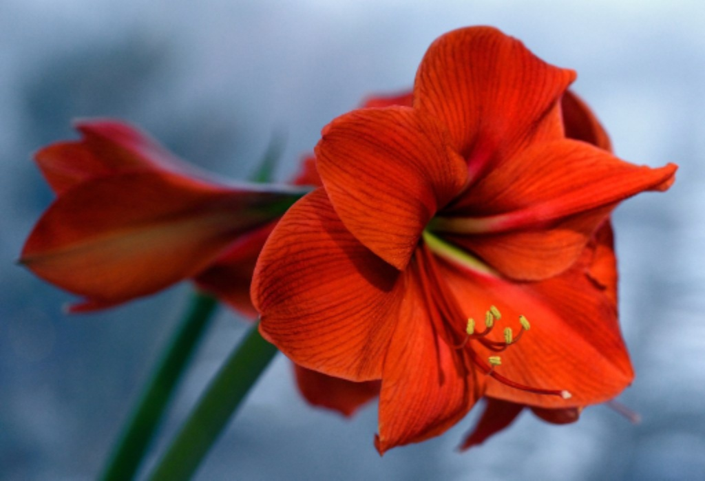
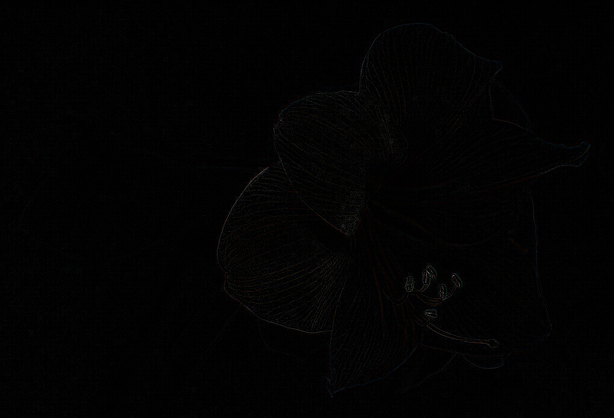
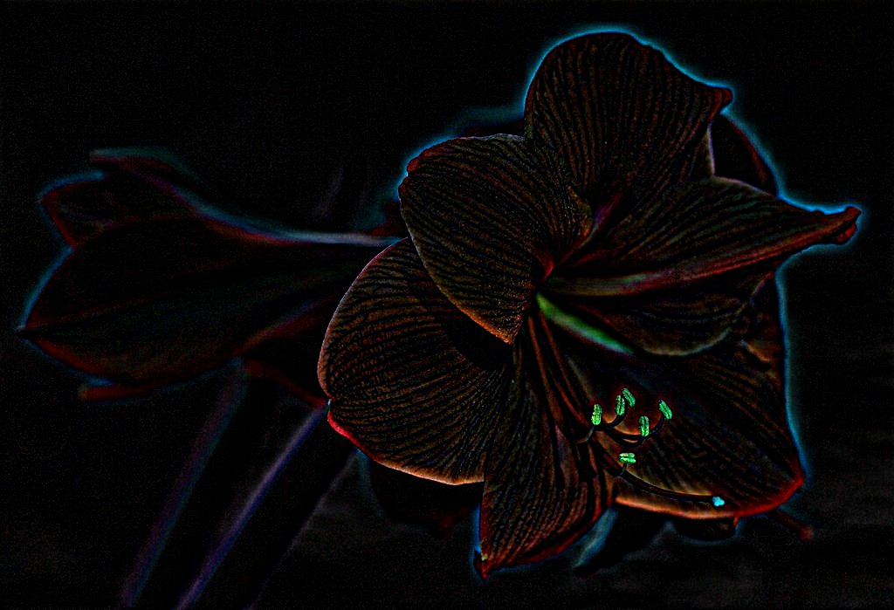

Use the same image as in HW6: 

1) Generate and show four levels of multi-resolution. Use a Gaussian kernel of your choice. 

2) Generate and show four levels of multi-scale. Use the same Gaussian kernel as above.

3) Generate Laplacian planes using a Laplacian kernel of your choice (can use Laplacian of Gaussian, or Laplacian).

4) Generate approximation to Laplacian using the difference of Gaussian planes from (1). Note, you need to do 'Expand' on images before taking the difference.

5) Generate approximation to Laplacian using the difference of Gaussian planes from (2)

 

Provide code (can use in-built functions as may be needed), comments (if any), and output images.

Results
===

  
  
  
  
  
  
  
  
  
  
  